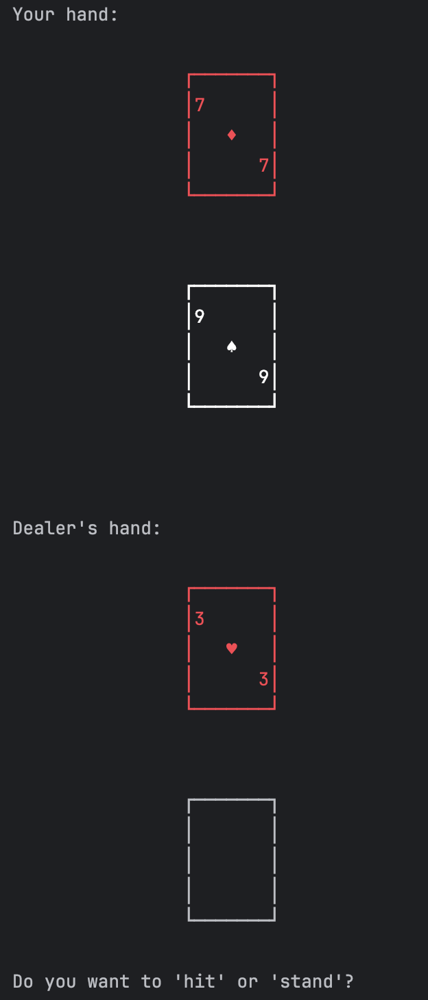
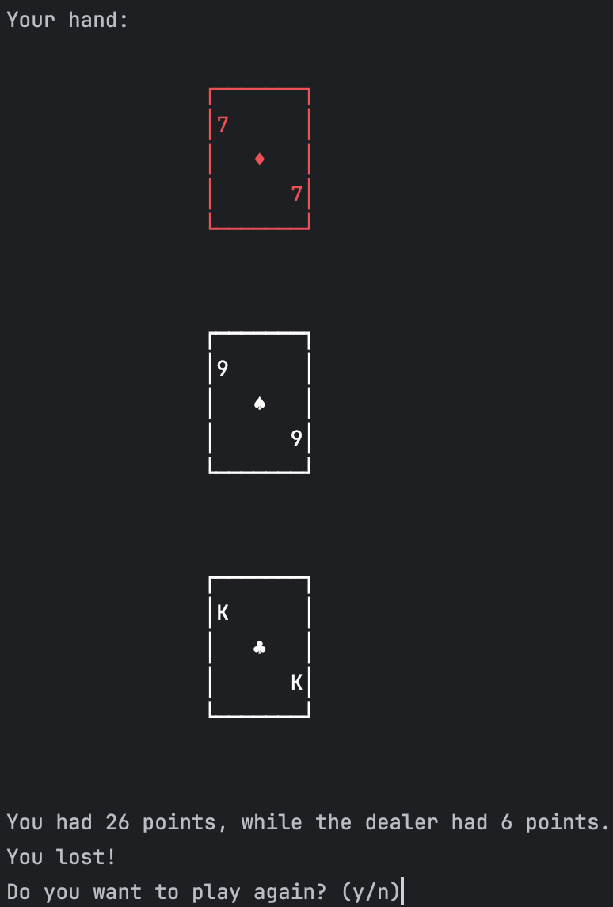

# Blackjack Game

This is a **basic Blackjack game** built for the terminal.
It includes simple visuals with **red/white colored cards** to make the gameplay more engaging.
Core features like **hitting** and **standing** are implemented, but the game endings still need refinement.

---

## Screenshots

<p align="center">
  
  
</p>

---

## Features

* Visual card display in the terminal (colored red/white).
* Core Blackjack mechanics:

  * Hit
  * Stand

---

## Rules (Simplified)

* The goal is to have your cards total closer to **21** than the dealer’s without going over.
* Number cards are worth their face value.
* Face cards (**J, Q, K**) are worth **10**.
* Aces (**A**) can be worth **1** or **11**, whichever benefits the hand.
* You can:

  * **Hit**: Take another card.
  * **Stand**: Keep your current total.
* If your hand exceeds **21**, you bust and lose.

---

## Planned Features

* Betting system
* Splitting pairs
* Improved visuals (beyond terminal)

---

## How to Run

1. Clone this repository:

   ```bash
   git clone https://github.com/yourusername/blackjack-game.git
   ```
2. Navigate into the project folder:

   ```bash
   cd blackjack-game
   ```
3. Run the game:

   ```bash
   python blackjack.py
   ```

---

## License

This project is open-source and available under the [MIT License](LICENSE).
